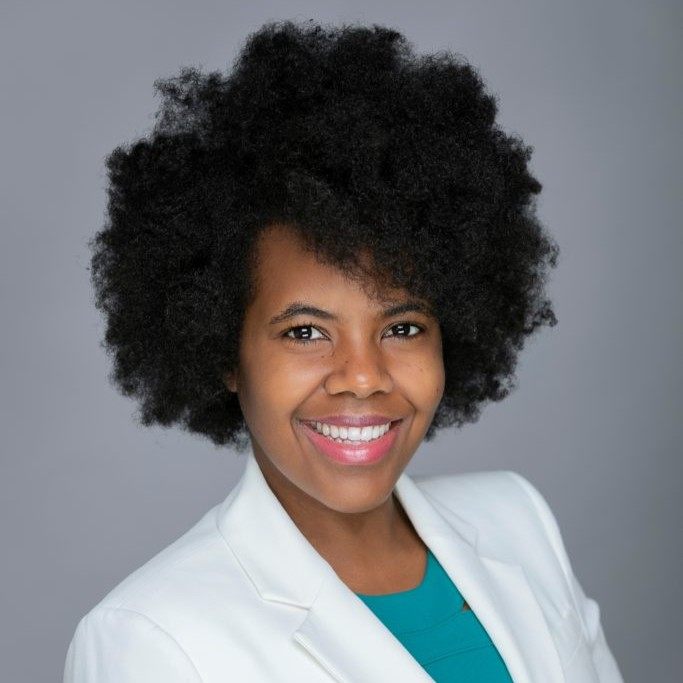

## CAFPA Board Members

::: columns
::: {.column width="70%"}
### Elizabeth Reed
#### President
Microbiologist
FDA’s Center for Food Safety and Applied Nutrition
[elizabeth.reed@fda.hhs.gov](mailto:elizabeth.reed@fda.hhs.gov)
:::

::: {.column width="30%"}
{.board-portrait}
:::
:::

 

::: columns
::: {.column width="70%"}
### Bob Ferguson
#### Vice President
President
Strategic Consulting, Inc. 
[bob@strategic-consult.com](mailto:bob@strategic-consult.com)
:::

::: {.column width="30%"}
{.board-portrait}
:::
:::

 

::: columns
::: {.column width="70%"}
### Claire Murphy
#### Secretary
Ph.D. Student
Dept. of Food Science & Technology, Virginia Tech
[cmarik@vt.edu](mailto:cmarik@vt.edu)
:::

::: {.column width="30%"}
{.board-portrait}
:::
:::
 

::: columns
::: {.column width="70%"}
### Lory Reveil
#### Treasurer
Director of Scientific & Regulatory Affairs
American Frozen Food Institute
[lreveil@affi.com](mailto:lreveil@affi.com)
:::

::: {.column width="30%"}
{.board-portrait}
:::
:::
 

::: columns
::: {.column width="70%"}
### Sanjay Gummalla
#### President Emeritus
Senior VP of Scientific Affairs
American Frozen Food Institute
[sgummalla@affi.com](mailto:sgummalla@affi.com)
:::

::: {.column width="30%"}
{.board-portrait}
:::
:::
 