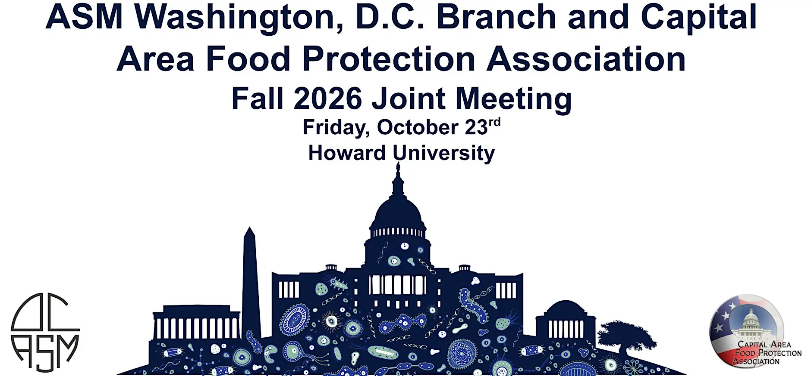

Please join us for the ASM Washington, D.C. branch Joint Fall Meeting with the Capital Area Food Protection Association (CAFPA) that will be held on Friday, October 23rd, 2026 from 10AM-4PM (9AM Check-in) on Howard University’s campus!

::: {.center}
[Event Registration](https://www.eventbrite.com/e/asm-washington-dc-branch-and-cafpa-fall-2026-joint-meeting-tickets-2000870624901)
:::

This joint meeting also features exciting talks from our invited keynote speakers:

Dr. Kali Kniel - Professor, Microbial Food Safety, University of Delaware, Department of Animal and Food Sciences

Dr. Manan Sharma - President, International Association for Food Protection, Former Research Microbiologist @ USDA

Dr. Conrad Choiniere - Director, Office of Microbiological Food Safety @ FDA's Human Foods Program

Dr. Kalmia “Kali” Kniel is the Unidel S. Hallock du Pont Chair of Microbial Food Safety in the University of Delaware’s Department of Animal and Food Sciences and director of the Center for Environmental and Wastewater Epidemiological Research. Her research examines the environmental persistence and transmission of foodborne viruses, protozoa and pathogenic bacteria, with particular emphasis on preharvest produce safety, agricultural water and soil amendments. Dr. Kniel is also a past President of the International Association for Food Protection.

Dr. Manan Sharma is a food microbiologist and recognized leader in preharvest produce safety. During a 21-year career with USDA’s Agricultural Research Service, he served as lead scientist and research microbiologist in the Environmental Microbial and Food Safety Laboratory, studying the survival and persistence of enteric pathogens in soil amendments, irrigation water, and fruit and vegetable production environments. Dr. Sharma is the current President of the International Association for Food Protection and a past president of the Capitol Area Food Protection Association (CAFPA). He recently joined The Acheson Group as Senior Director for Produce and Food Safety.

Dr. Conrad Choiniere is the Director of the Office of Microbiological Food Safety at FDA’s Human Foods Program. He oversees regulatory policy for managing microbial risks in foods and developing strategies for the prevention of foodborne illness. He has been with the Agency for over twenty years working in a variety of roles, in both food safety and tobacco control, primarily focused on risk and decision analysis, social and behavioral sciences, and executive leadership. Conrad has a doctorate in agricultural economics from the University of Maryland and a bachelor’s in chemical engineering from the Johns Hopkins University.

Come join us to hear some really great talks and learn about interesting science, and network with local Microbiologists in the DC area!