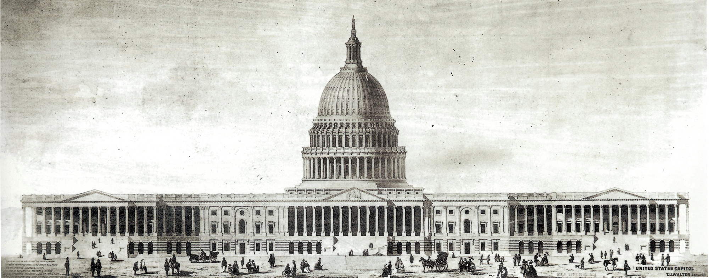

## The D.C. Region’s IAFP Affiliate
Welcome to the Capitol Area Food Protection Association (CAFPA) website. We are the regional chapter of the  [International Association for Food Protection (IAFP)](https://foodprotection.org) for the Capitol Region which includes Washington DC, Virginia, Maryland, and Delaware. CAFPA is in the unique position of being within the Washington DC beltway, the center of the federal government and home to the FDA, USDA and many national associations representing every aspect of food safety.

The International Association for Food Protection (IAFP) represents a broad range of members with a singular focus — protecting the global food supply. Within the association, you will find educators, government officials, microbiologists, food industry executives and quality control professionals who are involved in all aspects of growing, storing, transporting, processing, and preparing all types of foods. Working together, IAFP members, representing more than 50 countries, help the association achieve its mission through networking, educational programs, journals, career opportunities and numerous other resources.

Our goal at CAFPA is to promote these objectives of IAFP and to provide a local forum to encourage improvement of all areas of food safety and quality. Our membership includes food and beverage processors, manufacturers and their suppliers, government and regulatory officials, national and international associations, food transportation companies, laboratories and other food and beverage related entities.

